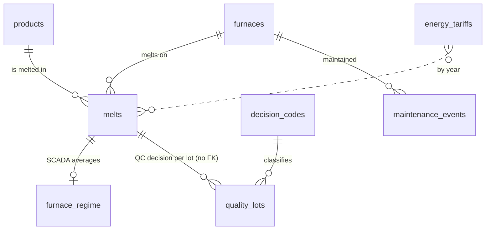

# Melt-shop SQL

**Ivan Shamin** · [GitHub](https://github.com/IvanShamin) · [LinkedIn](https://www.linkedin.com/in/ivanshamin/) · [MIT licence](LICENSE)
Companion repository: [glaze-bom-sql](https://github.com/IvanShamin/glaze-bom-sql) — recipes, chemistry, costing and supplier what-if.

I wrote the originals of these queries while building a production-analytics
module for a manufacturing plant, as its only data person. They are rebuilt
here on synthetic data so they can be public: the schema, the codes and every
number are new; the problems, and the way they are solved, are the ones from
the plant.

Ten files in three levels, from a first schema to a transactional refresh
that refuses to commit numbers that do not reconcile. The setting is a melting
shop — continuous and batch furnaces melting glass frit — and every query
started as a real question from production, quality or economics: a charge
that was not weighed for years, a control system that stopped logging,
material booked to the wrong order, a business rule that changed halfway
through the history.

**Dialect:** MySQL 8.0 · **Data:** synthetic, generated by
[`data/generate_seed.py`](data/generate_seed.py) with a fixed seed · **Runs in:** a few seconds

## Contents

| # | File | Level | Question it answers | Techniques |
|---|------|-------|---------------------|------------|
| 01 | [`01_schema.sql`](level-1-foundations/01_schema.sql) | 1 | What does the data look like? | keys, CHECK constraints, generated column, NULL by design |
| 02 | [`02_seed_data.sql`](data/02_seed_data.sql) | — | 1 246 melts, 6 890 QC lots, 2020–2026 | generated, do not edit |
| 03 | [`03_basic_reporting.sql`](level-1-foundations/03_basic_reporting.sql) | 1 | How much, where, which products? | GROUP BY, HAVING, JOIN, CASE, the average-of-ratios trap |
| 04 | [`04_raw_to_clean_etl.sql`](level-2-intermediate/04_raw_to_clean_etl.sql) | 2 | How do we load a messy ERP export safely? | text-only staging, REGEXP validation, ROW_NUMBER de-dup, rejects report |
| 05 | [`05_data_quality_audit.sql`](level-2-intermediate/05_data_quality_audit.sql) | 2 | What is missing, and is it a problem or a known limit? | completeness matrix, anti-joins, reconciliation, scorecard |
| 06 | [`06_weighted_kpis_and_quality.sql`](level-2-intermediate/06_weighted_kpis_and_quality.sql) | 2 | KPIs that survive scrutiny; what does non-quality cost? | weighted ratios, pivot, rule-change awareness, cost model |
| 07 | [`07_campaigns_gaps_and_islands.sql`](level-3-advanced/07_campaigns_gaps_and_islands.sql) | 3 | Why do some melts produce more than was charged? | LAG, running SUM, gaps and islands, window aggregates |
| 08 | [`08_gas_model_regression.sql`](level-3-advanced/08_gas_model_regression.sql) | 3 | Standing vs. melting gas; did the overhaul pay off? | least squares from sums, R², correlation, mix-adjusted before/after |
| 09 | [`09_window_analytics.sql`](level-3-advanced/09_window_analytics.sql) | 3 | Is this product drifting? Is this melt unusual? | ROW_NUMBER, z-scores with fallback, weighted moving ratio, NTILE |
| 10 | [`10_idempotent_migration.sql`](level-3-advanced/10_idempotent_migration.sql) | 3 | How do we ship a change that can be run twice? | conditional DDL, UPDATE from CTE, procedure with ROLLBACK, checksum |

**Level 1 — Foundations.** Schema design and the reports a manager asks for first.
**Level 2 — Intermediate.** Getting data in cleanly, auditing it, and computing KPIs correctly.
**Level 3 — Advanced.** Window functions, statistics in SQL, and deployment discipline.

## Run it

```bash
# MySQL 8.0 running locally
bash run_all.sh                          # default: mysql -uroot
MYSQL="mysql -u me -p" bash run_all.sh   # or with your own client command
```

`run_all.sh` drops and recreates the `melt_shop` database, loads the seed and
runs every file in order; results land in `output/`. The results of the last
run are committed there too, so every query can be read together with what it
returns without running anything. Each file can also be run on its own after
01 and 02.

To regenerate the data (same seed, same result):

```bash
python3 data/generate_seed.py > data/02_seed_data.sql
```

## Data model



`quality_lots` has no foreign key to `melts` on purpose: it comes from a
separate QC system, and orders it knows but production does not are something
to report (file 05), not something a constraint should silently reject.

## What the queries find

On the synthetic data — the same effects exist in the real one.

- **An average of ratios misstates plant throughput by about 10 %.**
  Averaging per-melt kg/h gives small batch furnaces the same weight as
  80-tonne continuous melts. (03)
- **Aligning numerator and denominator matters more than any formula.**
  With the charge unweighed on most 2020 orders, `1 - SUM(output)/SUM(charge)`
  reports a loss of **−226 %**; restricting both sums to the same rows gives 7.8 %. (06)
- **54 physically impossible melts are not errors.** Output larger than the
  charge comes from material booked across consecutive orders of the same
  product. Grouped into runs (gaps and islands), all 54 disappear and the
  plant-level loss does not move. (07)
- **A model can fit well and still say nothing.** Hours and tonnes correlate
  at 0.9+, so gas is predicted with R² ≈ 0.99 while the split into standing
  and melting gas is unreliable. The negative coefficients flag the years in
  which a furnace changed from air to oxygen — two regimes in one model. (08)
- **Raw before/after comparisons lie.** After one overhaul gas per tonne
  rose in the raw numbers; adjusted for the product mix it fell by 4 %. (08)
- **A refresh that does not reconcile does not commit.** The derived table is
  rebuilt in a transaction and rolled back if it does not add up; running it
  twice gives an identical checksum. (10)

## Principles the files follow

- **Raw and clean are separate.** Load text as text, type it in a re-runnable
  step; a bad value becomes a report line, not a failed import.
- **NULL means "not measured", and stays NULL.** No oxygen on an air-fired
  furnace is not zero oxygen; an unweighed charge is not a zero charge.
- **Flag, don't fix.** Impossible rows are kept and marked until someone
  knows why they exist.
- **Ratios are sums over sums, over the same rows.**
- **Every figure that depends on an assumption says so next to it.**
- **Scripts are safe to run twice** and start with a "where am I" query.
- **Control figures come with expected values.** When they differ, find the
  cause — don't edit the expectation.

## MySQL 8 specifics worth knowing

| Situation | In MySQL 8 | Handled in |
|-----------|------------|------------|
| `ADD COLUMN IF NOT EXISTS` | not supported (MariaDB has it) | 10 — information_schema + PREPARE |
| `TRUNCATE` inside a transaction | implicit commit, cannot roll back | 10 — DELETE instead |
| `CAST('n/a' AS DECIMAL)` or a bad `STR_TO_DATE` in an INSERT | error under strict mode, not a warning | 04 — REGEXP check first |
| same TEMPORARY table twice in one query | "Can't reopen table" | 07 — derived table instead |
| `PIVOT` | does not exist | 05, 06 — conditional aggregation |

Porting notes: window functions, CTEs and conditional aggregation are
standard SQL and move unchanged to PostgreSQL or SQL Server; the procedure in
file 10 needs `plpgsql` / `T-SQL` syntax, and `REGEXP_LIKE` becomes `~` in
PostgreSQL or `LIKE` patterns / `TRY_CAST` in SQL Server.

## Licence

[MIT](LICENSE). The data is synthetic and may be reused freely.
